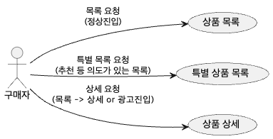
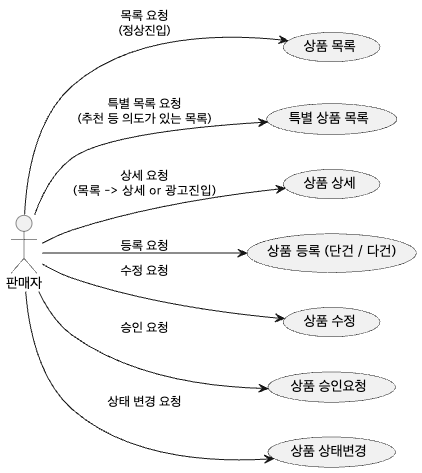
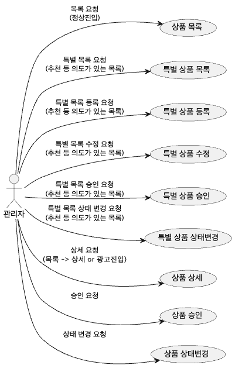

# 백엔드 포트폴리오

## converter 패키지
* [erd2sql.py](converter/erd2sql.py) 파일은 UML로 작성한 ERD를 .sql 파일로 변환해 바로 사용할 수 있게 해줌.
* [core_domains.yaml](converter/core_domains.yaml) 파일은 전체 시스템의 도메인을 정의한다.
* [product_domains.yaml](product/db/product_domains.yaml) 파일은 특정 모듈(product)에서 정해진 엔티티의 도메인을 정의한다.

    * 도메인 파일들은 복수로 인식 가능함.
    * 사용 예 (프로젝트 루트에서 실행시)
        
        python3 ./converter/erd2sql.py ./product/db/db.puml \
        --format plantuml \
        --config ./converter/core_domains.yaml \
        --config ./product/db/product_domains.yaml \
        --outdir ./product/db/sql \
        --name schema

## example 패키지
* UML 문법 예제 모음.

## product 패키지
### 쇼핑몰 상품 설계 요약
#### 우리 쇼핑몰에는 "구매자", "판매자", "관리자"가 있다고 가정함.
- [product/buyer_product.puml](product/buyer_product.puml) 파일은 소비자가 상품에 대한 액션(Use_case)을 정의함.
    
- [product/seller_product.puml](product/seller_product.puml) 파일은 판매자가 상품에 대한 액션(Use_case)을 정의함.
    
- [product/admin_product.puml](product/admin_product.puml) 파일은 관리자가 상품에 대한 액션(Use_case)을 정의함.
    

#### 구매자는 주로 상품을 "조회"한다.
