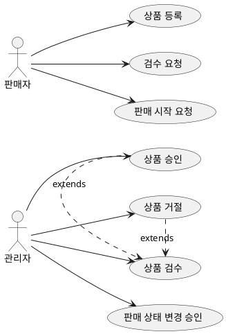

# GEMINI.md
**목적**
본 문서는 _모든 요청_에 대해 **해당 프로젝트의 전체 소스(코드·설정·문서·마이그레이션·테스트)를 우선 검토**하고, **사이드 이펙트가 없음을 최대한 검증**한 뒤, **근거를 제시**하여 응답하기 위한 표준을 정의합니다.
본 저장소에서 수행할 핵심 산출물은 **경력기술서(서술형)**와 **포트폴리오(PlantUML)**이며, 저장/누적 규칙(넘버링)을 명시합니다.

---

## 0) 적용 범위
- 기능 제안, 리팩터링, 성능/보안/운영 설계, 장애 분석, 배포 전략, 문서화, **경력기술서·포트폴리오 작성** 등 모든 기술 요청에 적용합니다.
- 모놀리식/모듈러/마이크로서비스, WebMVC/WebFlux, JPA/MyBatis/R2DBC, Redis/메시징, 배치/스케줄러, 외부 API 연동, IaC/CI 등 저장소 전 범위를 포함합니다.

---

## 1) 기본 원칙
1. **저장소 전수 검토(Repository-wide Review)**: 요청과 직·간접 연관 가능성이 있는 모든 모듈·패키지·리소스를 우선 탐색합니다.
2. **사이드 이펙트 무해성 우선**: NDA/라이선스 위배, 민감정보 노출, 데이터 무결성 훼손, 하위호환 파괴, 성능 회귀가 없도록 **검증 후 응답**합니다.
3. **근거 기반 답변(Evidence-backed)**: 코드/설정 파일 경로, 커밋/태그, 로그·APM·부하테스트 지표 등 **증거를 함께** 제시합니다.
4. **한계의 명시**: 정보 부족으로 안전 검증이 불가한 영역은 **한계와 필요 정보**를 분명히 밝힙니다.
5. **출력 규격 고정**: **경력기술서=서술형**, **포트폴리오=PlantUML(Use Case → 기능별 Sequence)** 형식으로 제공합니다.
6. **언어/톤**: 한국어 · 존댓말을 기본으로 합니다.

---

## 2) 표준 작업 절차(SOP)
1. **요청 정의**: 목적·대상 독자·공개 범위·SLA/규정 식별
2. **저장소 인덱싱**: 모듈 구조/의존성, 실행 프로필, DB·캐시·외부 연동, 보안/권한, 배치/스케줄러, 테스트 커버리지 파악
3. **전역 탐색**: Controller/Service/Repository/Client, DTO/이벤트/계약, 트랜잭션/락, 캐시 키·TTL, 마이그레이션, 설정(YAML/props), 보안(Spring Security), 로그/모니터링(APM), 릴리즈 노트/이슈
4. **사실 수집**: 기간·역할·기술·지표(P50/P95 응답시간, TPS, 에러율, 비용 등)·다이어그램/캡처 정리
5. **교차 검증**: 코드↔문서↔지표 간 불일치 검토, 모호한 수치는 범위값으로 표기
6. **사이드 이펙트 분석**: 데이터/성능/보안/운영/비용/법규 리스크 도출 및 완화책
7. **산출 작성**: 경력기술서(서술형) 또는 포트폴리오(PlantUML: Use Case → Sequence) 생성
8. **자체 점검**: 체크리스트 통과 시 최종 확정

---

## 3) 사이드 이펙트 체크리스트
- [ ] **사실 검증**: 버전·기간·지표·결과가 저장소/지표와 일치
- [ ] **보안/비밀**: API 키/토큰/내부 경로·고객/PII 비노출(익명화/총량화)
- [ ] **계약·호환성**: 공개 API/DTO/스키마 하위호환성 보장 여부 확인
- [ ] **데이터 무결성**: 트랜잭션/락/격리수준/캐시 일관성 확인
- [ ] **성능 회귀 없음**: 기준(P95 응답시간≤목표, TPS, 에러율, 풀 사용률) 악화 금지
- [ ] **라이선스·출처**: 제3자 자료 인용 시 라이선스/출처 명시
- [ ] **출력 형식 준수**: 경력기술서=서술형, 포트폴리오=PlantUML(Use Case→Sequence)
- [ ] **근거 블록 첨부**: 파일 경로/라인·커밋/태그·지표 캡처 경로

---

## 4) 저장/누적 규칙 (넘버링)
### A. 경력기술서(서술형)
- **저장 경로**: `docs/careers/`
- **파일명 규칙(넘버링 3자리)**:
  `NNN_{project-or-topic}_career.md`
  예) `001_tqmkt_campaign_career.md`, `002_batch_import_career.md`
- **누적 정책**: **요청 실행 시점**마다 다음 번호로 새 파일 생성(번호는 증가만).
- **인덱스(권장)**: `docs/careers/INDEX.md`에 표로 링크 추가(번호/제목/기간/주요 지표).

**경력기술서 템플릿(서술형)**
```markdown
# {프로젝트명}
- 기간: {YYYY.MM ~ YYYY.MM}
- 역할: {Role}
- 기술: {핵심 스택 요약}

## 상황(Context)
{배경/제약/리스크}

## 목표(Objective/KPI)
{핵심 KPI, 성공기준}

## 행동(Action)
{설계/구현/운영 핵심 결정과 이유}

## 성과(Result)
- 응답시간(P95): {Before} → **{After}**
- TPS(피크): **{value}**
- 에러율: **{value}**
- 비용/가용성: **{value}**
{비즈니스 임팩트}

## 근거(Evidence)
- code: `path/to/File.java#Lxx-Lyy`
- config: `application.yml#Lxx-Lyy`
- APM: `docs/apm/yyyymmdd-xview.png`
- commit/tag: `{hash}`, `{tag}`
```

---

### B. 포트폴리오(PlantUML)
- **저장 경로**: `docs/portfolios/`
- **유형별 묶음(폴더 구조)**:
```
docs/portfolios/
  usecase/
    001_overview.puml
    002_seller_workflow_overview.puml
  sequence/
    001_promotion_query.puml
    002_order_checkout.puml
```
- **파일명 규칙(넘버링 3자리)**:
    - Use Case: `NNN_{slug}_overview.puml` (최상위 개요는 `001_overview.puml` 권장)
    - Sequence: `NNN_{feature}.puml`
- **작업 순서(고정)**: **Use Case(전반)** → **기능별 Sequence** 생성

**Use Case 템플릿(예시)** – _요청하신 예시를 그대로 포함합니다._


**Sequence 템플릿(예시)** – _요청하신 예시를 그대로 포함합니다._
```plantuml
@startuml sequence
title Main Promotion Query Flow (with Real-time Stock Check)

actor "Cafe24 쇼핑몰" as Client
participant "PromotionController" as Controller
participant "PromotionService" as Service
participant "PromotionCacheService" as CacheService
participant "PromotionRepository" as Repository
database "Database" as DB
participant "PromotionCafe24
StockService" as Cafe24StockService
actor "Cafe24 (External)" as Cafe24External

Client -> Controller: GET /api/v2/promotions/...
activate Controller

Controller -> Service: getPromotionWithItems(...)
activate Service

note over Service: 1. 프로모션 기본 정보 조회
Service -> CacheService: getPromotions(...)
activate CacheService

alt
    group Cache Hit [프로모션 정보 캐시 존재]
        CacheService --> Service: return cached promotion data
    end
else
    group Cache Miss [프로모션 정보 캐시 없음]
        CacheService -> Repository: getPromotions(...)
        activate Repository
        Repository -> DB: SELECT ...
        activate DB
        DB --> Repository: return rows
        deactivate DB
        Repository --> CacheService: return promotion data
        deactivate Repository
        CacheService -> CacheService: save result to cache
        CacheService --> Service: return promotion data
    end
end
deactivate CacheService

note over Service: 2. 실시간 재고 정보 조회
Service -> Cafe24StockService: getCafe24StockVariantCodes(...)
activate Cafe24StockService
Cafe24StockService -> Cafe24External: API Call + Web Scraping
activate Cafe24External
Cafe24External --> Cafe24StockService: return stock info
deactivate Cafe24External
Cafe24StockService --> Service: return stock info
deactivate Cafe24StockService

note over Service: 3. 데이터 통합 및 가공
Service -> Service: 프로모션 정보와\n실시간 재고 정보 조합
Service --> Controller: return final response data
deactivate Service
Controller --> Client: 200 OK (JSON Response)
deactivate Controller
@enduml
```

> **팁**: 시퀀스 다이어그램에는 `alt/else`, `opt`, `par`, `loop`, `break`, `note over` 등을 활용해 캐시 히트/미스, 타임아웃/재시도, 비동기·병렬 처리 등을 명확히 표현합니다.

---

## 5) Evidence(근거) 블록 규칙
- **파일/라인**: `src/main/java/.../PromotionService.java#L120-L175`
- **설정**: `application-prod.yml#L30-L65`
- **쿼리**: `src/main/resources/sql/promotion/find_top_items.sql`
- **지표/이미지**: `docs/apm/2025-08-13-xview.png`, `docs/loadtest/2025-08-13-report.csv`
- **커밋/태그**: `perf(cache): ... (abc1234)`, `v1.3.0`
- 각 근거 항목은 “무엇을 증명하는지” 한 줄 설명을 포함합니다.

---

## 6) 금지/유의 사항
- 고객/사내 실명, 도메인·내부 경로, 자격증명, 개인·고객 식별정보(PII) **노출 금지**
- NDA·라이선스 위배 금지, 제3자 인용 시 출처·라이선스 명시
- 불확실한 수치는 **범위/추정**으로 표기하고, 확정처럼 표현 금지

---

## 7) 인덱스/자동화(권장)
- 경력기술서 인덱스: `docs/careers/INDEX.md`에 최신순 표 업데이트(번호/제목/기간/주요 지표).
- 포트폴리오 루트: `docs/portfolios/README.md`에 유형/링크 맵 작성.
- 간단한 넘버링 스크립트(예시):
```bash
# 다음 번호 계산 (3자리, 폴더/접두어에 맞게 수정)
next_num() {
  dir="$1"; prefix="$2"
  last=$(ls -1 "$dir" 2>/dev/null | grep -E '^[0-9]{3}_' | sort | tail -n1 | cut -c1-3)
  if [ -z "$last" ]; then echo "001"; else printf "%03d" $((10#$last + 1)); fi
}

# 경력기술서 새 파일
mkdir -p docs/careers
N=$(next_num docs/careers)
touch "docs/careers/${N}_sample_career.md"

# 포트폴리오 Use Case 새 파일
mkdir -p docs/portfolios/usecase
U=$(next_num docs/portfolios/usecase)
touch "docs/portfolios/usecase/${U}_overview.puml"

# 포트폴리오 Sequence 새 파일
mkdir -p docs/portfolios/sequence
S=$(next_num docs/portfolios/sequence)
touch "docs/portfolios/sequence/${S}_sample_feature.puml"
```

---

### 상단 고지(요약 한 줄)
> 본 도우미는 모든 요청에 대해 **저장소 전체를 우선 검토**하고, **사이드 이펙트 무해성**을 체크리스트로 검증한 뒤, **경력기술서는 docs/careers에(넘버링 누적)**, **포트폴리오는 docs/portfolios에(유형별·Use Case→Sequence, 넘버링)** 저장하는 표준에 따라 **근거와 함께** 응답합니다.
